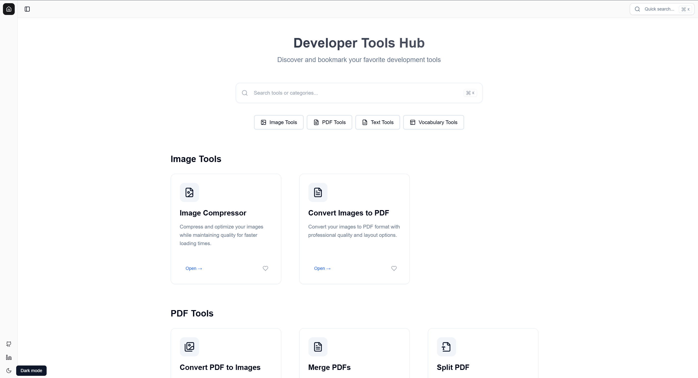

# Toolz

A modern, client-side tools platform offering a collection of useful utilities to enhance your productivity.



## Features

### PDF Tools

-   📄 Split PDF - Divide your PDF documents into smaller parts
-   🔄 Merge PDF - Combine multiple PDF files into one
-   🖼️ Convert to Images - Transform PDF pages into image files

### Image Tools

-   🗜️ Compress Images - Reduce image file size while maintaining quality
-   📑 Convert to PDF - Turn your images into PDF documents

### Text Tools

-   🔍 Compare Text - Find differences between two text snippets

### Vocabulary Tools

-   📝 Flash Cards - Create and manage vocabulary flash cards for learning

## Tech Stack

-   **Next.js** - React framework for the frontend
-   **TypeScript** - For type safety and better development experience
-   **TailwindCSS** - For styling and responsive design
-   **Shadcn/UI** - For beautiful and accessible UI components
-   **Zustand** - For state management
-   **Radix UI** - For headless UI components

## Project Structure

```
├── app/                  # Next.js app directory
├── components/
│   ├── app-ui/          # Core UI components
│   ├── tools/           # Tool-specific components
│   └── ui/              # Shadcn UI components
├── store/               # Zustand stores
├── tools/               # Tool implementations
├── types/               # TypeScript types
└── data/                # Static data and configurations
```

## Development

1. Clone the repository
2. Install dependencies:
    ```bash
    npm install
    ```
3. Run the development server:
    ```bash
    npm run dev
    ```
4. Open [http://localhost:3000](http://localhost:3000) in your browser

## Key Features

-   🎯 Pure client-side processing - Your data never leaves your browser
-   🎨 Modern and responsive UI with TailwindCSS
-   ♿ Accessible components using Radix UI
-   📱 Mobile-friendly design
-   🔄 State persistence using Zustand
-   🌐 No backend required - works entirely in the browser

## Future Ideas

### New Tools

-   [ ] Add CSV tools (merge, split, convert)
-   [ ] Add audio tools (convert, compress, trim)
-   [ ] Add video tools (compress, convert, trim)
-   [ ] Add code formatting and beautification tools
-   [ ] Add markdown preview and conversion tools
-   [ ] Add color tools (picker, palette generator)
-   [ ] Add QR code generator and reader

### Features & Enhancements

-   [x] Add dark/light theme toggle
-   [x] Implement tool favorites
-   [ ] Implement recent tools
-   [ ] Add user preferences and settings
-   [ ] Add progress indicators for long operations

### AI Integration

-   [ ] Allow Users to add use local LLM models or use their own api keys to use LLM models (OpenAI, Anthropic, Google, Groq, etc.)
-   [ ] Make tools to use LLM models like SEO, Re-write, Summarize, Trip Advisor, etc.

### Performance & UX Improvements

-   [ ] Implement web workers for heavy computations
-   [ ] Add offline support with service workers
-   [ ] Add batch processing capabilities
-   [ ] Improve mobile responsiveness

## Contributing

Contributions are welcome! Please feel free to submit a Pull Request.

## License

MIT License - feel free to use this project for personal or commercial purposes.
